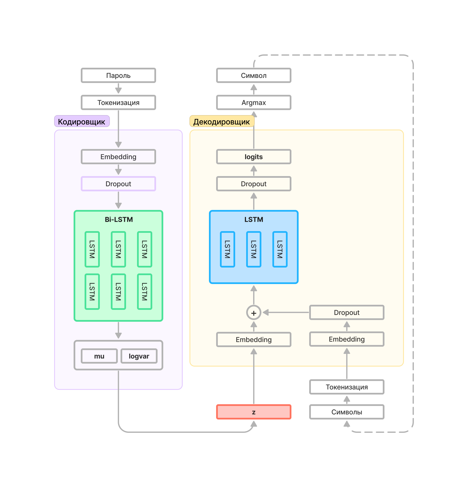
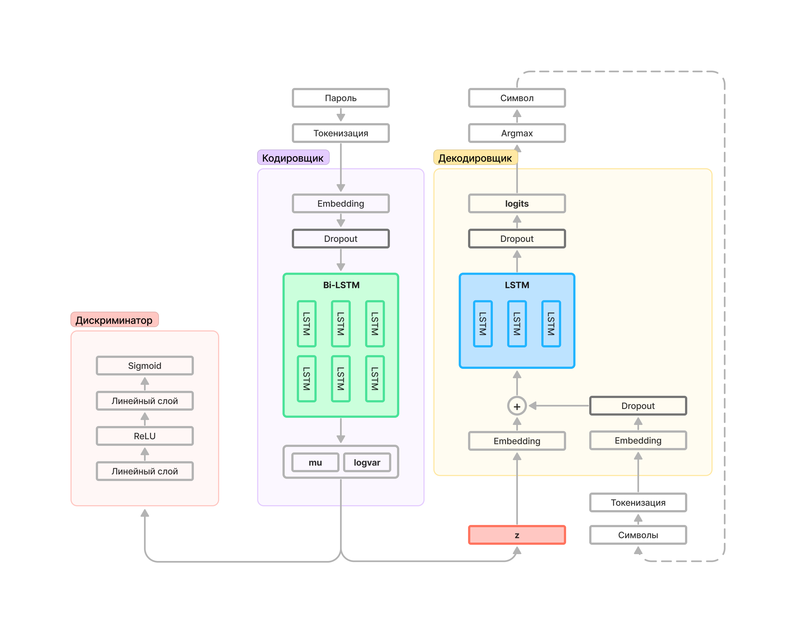

# Password AutoEncoders


## Using

```bash
pipenv install
```
### simple inference
```bash
pipenv run python3 sample.py --pii=/path/to/personal_ident_info.txt --stdout
```

### see more
```
usage: sample.py [-h] [--method M] [--wordlist_first FILE] [--log_file FILE] [--save_dir DIR] [--load_model PATH] [--repo_id REPO]
                 [--local] [--batch_size B] [--sigmas_n N] [--sigma_min SMIN] [--sigma_max SMAX] [--pii FILE|DIR] [--stdout] [--cuda]

sample autogen

optional arguments:
  -h, --help            show this help message and exit
  --method M            which model to generate
  --wordlist_first FILE
                        first popular wordlist
  --log_file FILE       path to logging
  --save_dir DIR        directory to save checkpoints and outputs
  --load_model PATH     path to load checkpoint if specified
  --repo_id REPO        path to repo src of model
  --local               using load_model arg as local path
  --batch_size B        batch size
  --sigmas_n N          pints of sigmas on [sigma_min, sigma_max]
  --sigma_min SMIN      min sigma sampling
  --sigma_max SMAX      max sigma sampling
  --pii FILE|DIR        path to leaked info, (PII, passwords, nicks, etc.)
  --stdout              print password to stdout
  --cuda                sampling on CUDA
```

## Базовая архитектура автокодировщика




## Базовая архитектура состязательного автокодировщика


